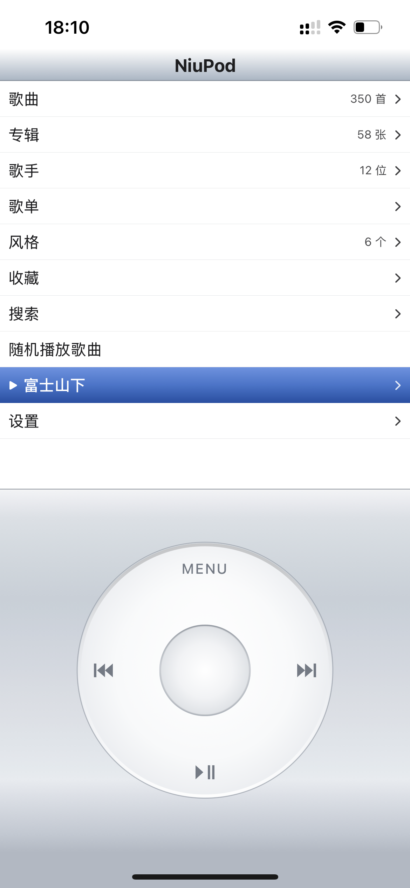
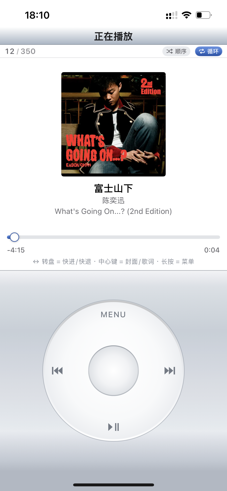

# NiuPod — 飞牛音乐 · iPod 风格

NiuPod 是[飞牛私有云（FNOS）](https://www.fnos.com/)音乐服务的**非官方**第三方 iOS 客户端，
把飞牛 NAS 的音乐库装进一台「iPod Classic」风格的界面：金属机身、内嵌屏、Click Wheel 转盘交互，以及完整的在线播放体验。

> **非官方项目**：与飞牛 / FNOS 官方无任何关联、授权或赞助关系。详见文末[重要声明](#重要声明)。

## 界面预览

<table>
<tr>
<td align="center">

<br>主页

</td>
<td align="center">

<br>播放

</td>
<td align="center">

<br>歌词

</td>
</tr>
</table>

---

## 功能特性

- **FN Connect 自动选路**：凭 FNID 在内网 / 公网 IPv6 / 公网 IPv4 / 中继间自动选链路，网络切换实时感知、失败自动重连。
- **飞牛音乐 API**：歌曲 / 专辑 / 歌手 / 歌单 / 风格 / 收藏 / 搜索 / 歌词 / 播放历史。
- **认证音频流**：AVPlayer 注入 `music-token` Cookie 播放 NAS 私有音频，支持直连与自签名证书。
- **后台与锁屏控制**：控制中心、耳机、CarPlay 可切歌 / 暂停 / 拖进度。
- **iPod 交互**：Click Wheel 环形滑动 + 触觉反馈，MENU / 上一首 / 下一首 / 播放暂停四区按键，长按中心键呼出曲目菜单。
- **LRC 歌词**：滚动跟随、译文合并、逐字时间轴。

---

## 快速开始

要求：iOS 17.0+ / Xcode 16.0+ / [xcodegen](https://github.com/yonaskolb/XcodeGen)。`.xcodeproj` 由 `project.yml` 生成，请勿直接提交。

```bash
brew install xcodegen
./scripts/set-team.sh ABC123DEFG   # 配置你的 Apple 团队 ID
open NiuPod.xcodeproj
```

**签名说明**：团队 ID 绑个人 Apple 账号，不入库。`project.yml` 里是 `${NIUPOD_TEAM_ID}`，
`set-team.sh` 将其写入本地 `.niupod-team`（已 gitignore），`generate.sh` 自动注入；
也可 `export NIUPOD_TEAM_ID=xxx` 替代。只用模拟器可跳过，Xcode 里手动选团队即可。

**真机运行**：连接 iPhone 直接运行。首次安装需开启开发者模式（`设置 > 隐私与安全性 > 开发者模式`）；
提示不受信任开发者时到 `设置 > 通用 > VPN 与设备管理` 信任证书；免费个人证书约 7 天过期，重跑一次即续。

**命令行构建**：

```bash
./scripts/build.sh        # 编译
./scripts/build.sh test   # 编译 + 单元测试
./scripts/build.sh ui     # 编译 + UI 测试
```

---

## 连接你的 NAS

1. **推荐用 FNID**：填入飞牛设备提供的 FNID，App 自动探测所有可用链路。
2. **或手动地址**：如 `http://192.168.1.2:5666`；NAS 开启 HTTP 强制跳转 HTTPS 时 App 会自动改用 HTTPS。
3. 输入用户名 / 密码 / 安全码（如服务器开启访问码），点「连接」。

---

## 转盘操作

| 区域 | 菜单页 | 曲目列表页 | 正在播放 |
|---|---|---|---|
| 旋转 | 上下移动选中行 | 上下选曲 | 快进 / 快退（5 秒/步） |
| 中心键 | 进入 | 播放该曲 | 切换：进度 → 歌词 → 选项 |
| 长按中心键 | — | 曲目操作菜单 | — |
| MENU | 返回 | 返回 / 关闭菜单 | 返回 |
| ◀◀ / ▶▶ | 上一首 / 下一首 | 上一首 / 下一首 | 上一首 / 下一首 |
| ▶❙❙ | 播放 / 暂停 | 播放 / 暂停 | 播放 / 暂停 |

**曲目操作菜单**（长按中心键约 0.45 秒）：播放 / 收藏或取消收藏 / 取消。

---

## 隐私与安全

**数据去向**：App 只访问两个地方，无其他任何网络请求——

| 目标 | 用途 | 时机 |
|---|---|---|
| 你的飞牛 NAS | 登录、音乐库、音频流与歌词 | 全程 |
| `5ddd.com`（飞牛 FN Connect 中枢） | 用 FNID 换取 NAS 可用链路 | 仅 FNID 连接时的探测阶段 |

无第三方统计 / 崩溃上报 / 遥测 SDK，无个人账户体系，数据不经过本项目作者的服务器（不存在这样的服务器）。

**凭据存储**：token、安全码、密码存 Keychain；地址、FNID、用户名存 UserDefaults（仅用于重登自动填充）。
日志仅 DEBUG 输出且 `privacy: .private`，不打印 token 与密码。

**注意**：Keychain service 跟随 bundle ID（`com.niupod`），自行修改 bundle ID 后已存凭据需重新登录（预期行为）。
NAS 多为自签名 HTTPS，App 信任服务端证书并开启 ATS 任意加载——传输安全取决于你的 NAS 证书配置，陌生网络下建议只走内网。

---

## 项目结构

```
NiuPod/
├── project.yml            # xcodegen 工程配置（源码即配置）
├── NiuPod/
│   ├── FeiNiu/            # 飞牛连接核心（FNID / authx / 链路探测 / API）
│   ├── Player/            # 播放引擎（认证流 / AVPlayer / 锁屏控制）
│   ├── Data/              # 音乐库数据与状态
│   ├── UI/                # iPod 风格界面（转盘 / 机身 / 各页面）
│   └── Support/           # 日志、格式化、网络路径监听
├── NiuPodTests/           # 单元测试
├── NiuPodUITests/         # UI 测试
└── scripts/               # 工程生成 / 构建 / 冒烟 / 图标生成
```

---

## 重要声明

- 本项目为**非官方**第三方客户端，与飞牛 / FNOS 官方无任何关联、授权或赞助关系；飞牛、FNOS 及相关商标归其所有者所有。

---

## 开源协议

[MIT License](LICENSE)。核心连接逻辑参考并移植自 [kuilei0926/FeiNiuMusic](https://github.com/kuilei0926/FeiNiuMusic)，在此致谢。
